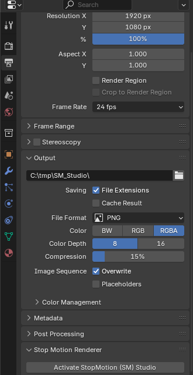
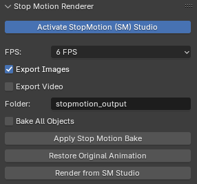
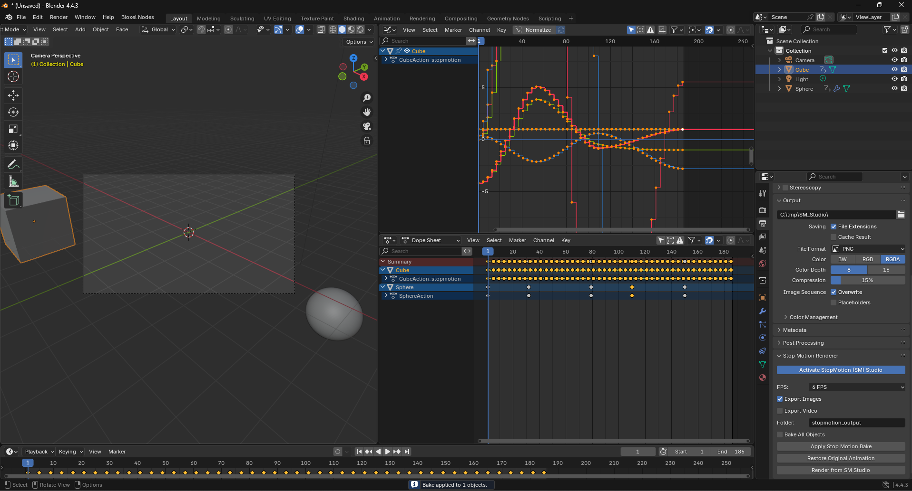
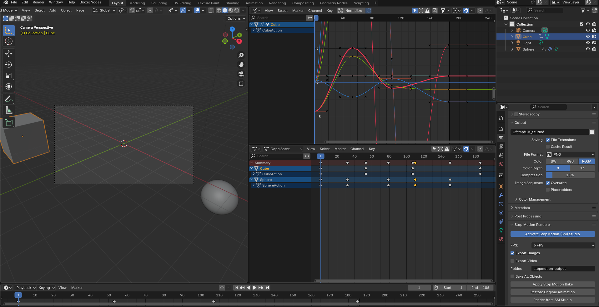
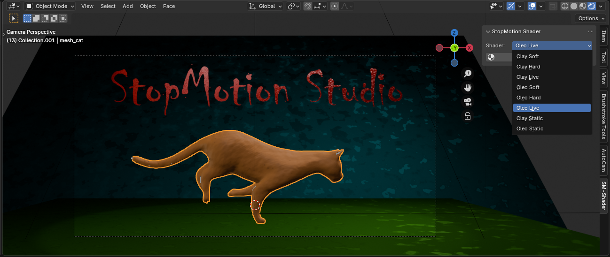
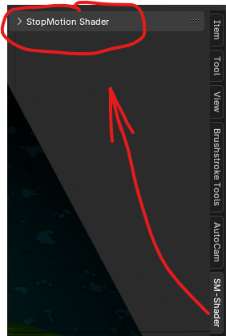
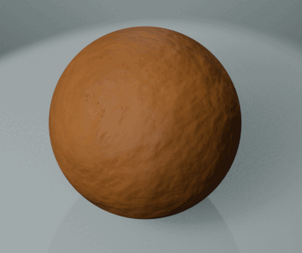
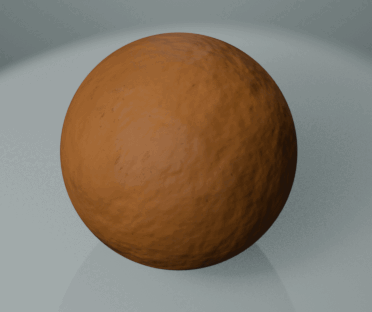
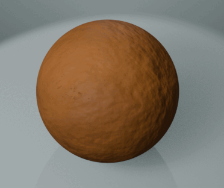
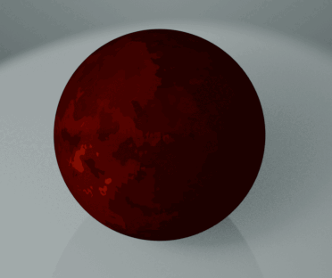

# StopMotionProduction Addon for Blender

---

## 💡 Overview

StopMotionProduction is a powerful Blender addon designed to streamline and enhance your stop motion animation workflow, whether you're working with 3D animations or looking to apply unique visual styles.

It simplifies the creation of renders with an authentic "stop motion" look and offers a suite of advanced procedural shaders that emulate clay and oil paint textures, with animated and static options to give your projects a distinctive artistic touch.

---

## ✨ Key Features

### 🎥 Stop Motion Production Module

* **Simplified Rendering:** Set up and render animations with the characteristic reduced-FPS stop motion effect, exporting image sequences or videos.
* **Animation Baking:** Apply the "stepping" animation effect to selected objects or all objects in your scene, converting fluid animations into frame-by-frame animations.
* **Animation Restoration:** Easily revert objects to their original animations, allowing you to experiment without losing your work.
* **FPS Control:** Choose from various FPS options (`2`, `4`, `6`, `8`, `12` FPS) to achieve the desired rhythm for your stop motion.

### 🎨 Procedural Shaders Module

* **Clay Shaders:**
    * **Clay Soft Animation:** A soft clay shader with subtle texture animation for an organic look. (Compatible with Eevee and Cycles).
    * **Clay Hard Animation:** A clay shader with a more robust and animated appearance. (Compatible with Eevee and Cycles).
    * **Clay Live Animation:** The most dynamic clay shader, with more pronounced texture animation. (Compatible with Eevee and Cycles).
    * **Clay Static:** Static versions of the clay shaders for a consistent look without animation. (Compatible with Eevee and Cycles).
* **Oil Paint (Oleo) Shaders:**
    * **Oleo Soft Animation:** A shader that simulates oil painting with a gentle animation of brushstrokes. (Compatible with Eevee).
    * **Oleo Hard Animation:** A more defined and animated version of the oil paint shader. (Compatible with Eevee).
    * **Oleo Live Animation:** The most expressive and animated oil paint shader, ideal for a "hand-painted" artistic style. (Compatible with Eevee).
    * **Oleo Static:** Static versions of the oil paint shaders for a fixed pictorial look. (Compatible with Eevee).
* **Easy Creation:** Select the desired shader from the panel and create it with a single click; it will be automatically added to your available materials.

---

## 🚀 Installation

1.  **Download:** Download the `StopMotionProduction_v1.2.zip` file from the [GitHub releases page](https://github.com/YourGitHubUsername/StopMotionProduction/releases) or from [Blender Market](https://blendermarket.com/creators/your-profile/products/stopmotionproduction). *(Make sure to change the URLs)*
2.  **Open Blender:** Launch Blender.
3.  **Preferences:** Go to `Edit > Preferences > Add-ons`.
4.  **Install:** Click the `Install...` button.
5.  **Select ZIP:** Navigate to where you downloaded the `StopMotionProduction_v1.2.zip` file and select it. Then click `Install Add-on`.
6.  **Activate:** Once installed, search for "StopMotionProduction" in the add-on list and **check the box** next to its name to activate it.

---

## 🛠️ How to Use

### Stop Motion Renderer Module

1.  **Open Panel:** In Blender, go to the `Render Properties` (the camera icon). You will find a new panel called **"Stop Motion Renderer"**.
   
    
    
3.  **Activate Studio:** Check the **"Activate StopMotion (SM) Studio"** box.
    
    
   
4.  **Configure Options:**
    * **FPS:** Choose the desired frames per second for the stop motion effect.
    * **Export Images:** Check if you want to export individual images for each rendered frame.
    * **Export Video:** Check if you want to export a compiled video directly (Blender will use the VSE if not already in use).
    * **Folder:** Define the name of the folder where your renders and videos will be saved.
5.  **Animation Bake:**
    * **Bake All Objects:** If checked, the "bake" will affect all animated objects in your scene. If unchecked, it will only affect the active/selected object.
    * Click **"Apply Stop Motion Bake"** to convert your fluid animation into stepped animation with the selected FPS.
    * Click **"Restore Original Animation"** to revert objects to their original animation.
    
    *(Baked on active object)*
    
    *(restored animation object)*
6.  **Render:** Click **"Render from SM Studio"** to start the rendering process with the applied stop motion settings.

### StopMotion Shader Module

1.  **Open Panel:** In the 3D Viewport, open the sidebar (by pressing `N`). You will find a new tab called **"SM-Shader"**.
   
    
   
3.  **Select Shader:** Choose the desired shader from the "Shader" dropdown menu.
4.  
    
    
5.  **Create Material:** Click the **"Create Shader Material"** button (with the material icon).
    * The new material will be created and appear in your Blender file's material list.
    * You can apply this material to any object just like any other Blender material.

### Visual Shader Examples

**Example: Clay Soft Animation shader**

**Example: Clay hard Animation shader**

**Example: Clay Live Animation shader**

**Example: Oleo hard Animation**

**Example: Oleo soft Animation**

**Example: Oleo Live Animation**

**Comparison: Original Animation vs. Baked Animation**

*(Replace with a GIF or image comparison)*

---

## ❓ Frequently Asked Questions (FAQ)

* **Q: Will my original animation be lost when using "Apply Stop Motion Bake"?**
    * A: No. The addon creates a copy of your original animation action and bakes that copy. You can always restore the original animation with the "Restore Original Animation" button.
* **Q: Are the shaders compatible with Eevee and Cycles?**
    * A: The Clay shaders are compatible with both engines. The Oleo shaders are optimized for Eevee and might not display the expected results in Cycles.
* **Q: What happens if the material already exists when creating a shader?**
    * A: The addon will generate a unique name for the new material (e.g., "Clay_soft_Animation_Eevee-Cycles.001") to prevent overwriting existing ones.
* **Q: Where are the renders saved?**
    * A: Renders are saved to the output path you've configured in Blender's render properties (`Output Properties > Output`). The addon will create subfolders (`_tmp`, `_images`) within that path.

---

**Thank you for using StopMotionProduction!**
I hope this addon helps you bring your animations to life with a unique style.

---
